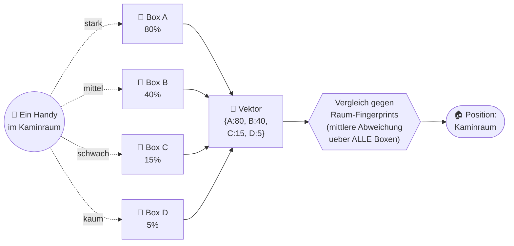
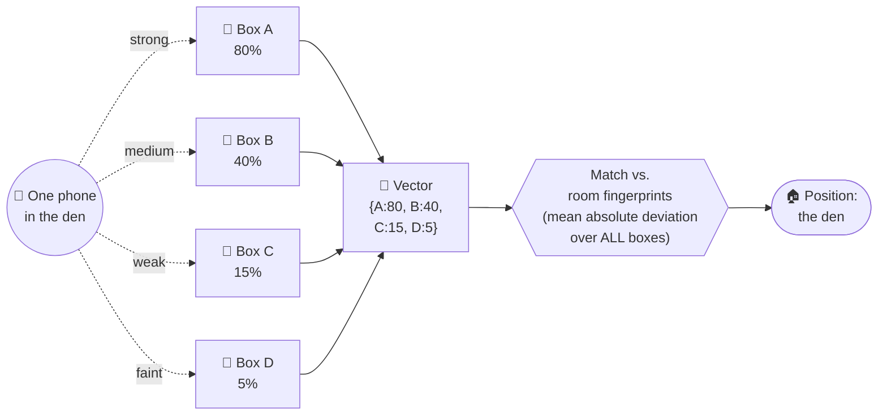
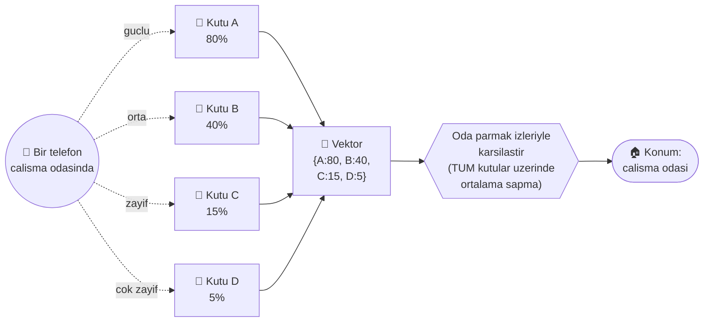

<!--
  ███████╗██████╗ ██╗████████╗███████╗████████╗██████╗  █████╗  ██████╗██╗  ██╗██╗  ██╗██╗   ██╗
  ██╔════╝██╔══██╗██║╚══██╔══╝╚══███╔╝╚══██╔══╝██╔══██╗██╔══██╗██╔════╝██║ ██╔╝██║  ██║██║   ██║
  █████╗  ██████╔╝██║   ██║     ███╔╝    ██║   ██████╔╝███████║██║     █████╔╝ ███████║██║   ██║
  ██╔══╝  ██╔══██╗██║   ██║    ███╔╝     ██║   ██╔══██╗██╔══██║██║     ██╔═██╗ ╚════██║██║   ██║
  ██║     ██║  ██║██║   ██║   ███████╗   ██║   ██║  ██║██║  ██║╚██████╗██║  ██╗     ██║╚██████╔╝
  ╚═╝     ╚═╝  ╚═╝╚═╝   ╚═╝   ╚══════╝   ╚═╝   ╚═╝  ╚═╝╚═╝  ╚═╝ ╚═════╝╚═╝  ╚═╝     ╚═╝ ╚═════╝
-->

<div align="center">

```
        FritzTrack4U  ·  Indoor-Ortung mit der Hardware, die du schon hast
  ┌───────────────────────────────────────────────────────────────────────────┐
  │   ╔═════════╗   2.OG · Buero          (•)Box D        [ • Murat ]           │
  │   ║ ▓▓▓▓▓▓▓ ║───────────────────────────────────────────────────           │
  │   ║ ▓▓▓▓▓▓▓ ║   1.OG · SARA           (•)Box C        [ • Sevda ]           │
  │   ║ ▓▓▓▓▓▓▓ ║───────────────────────────────────────────────────           │
  │   ║ ▓▓▓▓▓▓▓ ║   EG  · Kaminraum       (•)Box B        [ • Furkan]           │
  │   ║ ▓▓▓▓▓▓▓ ║───────────────────────────────────────────────────           │
  │   ║ ▓▓▓▓▓▓▓ ║   KG  · Keller          (•)Box A  ◀MASTER                     │
  │   ╚═════════╝                                                               │
  │                  ((  ·  ))  ein Handy  →  vier gleichzeitige Messungen      │
  │              {A:80%  B:40%  C:15%  D:5%}  →  Raum: Kaminraum                │
  └───────────────────────────────────────────────────────────────────────────┘
```

# 📡 FritzTrack4U

**Raumgenaue Indoor-Ortung per WLAN — mit den FritzBox-Routern, die ohnehin an der Wand haengen.**
**Room-level indoor positioning over Wi-Fi — using only the routers you already own.**
**Sahip oldugun WLAN router'lariyla, ev ici oda-bazli konum tespiti.**

[](https://www.python.org/)
[](https://www.home-assistant.io/)
[](#-vergleich--vs-esp32)
[](#-lizenz--license--lisans)
[](#-die-geschichte--the-story--hikaye)

**🌍 Sprache / Language / Dil:**  &nbsp; **[🇩🇪 Deutsch](#-deutsch)** &nbsp;·&nbsp; **[🇬🇧 English](#-english)** &nbsp;·&nbsp; **[🇹🇷 Tuerkce](#-turkce)**

</div>

> ⚖️ **Trademark / Marken-Hinweis**
> **DE —** FRITZ! und FRITZ!Box sind eingetragene Marken der FRITZ! GmbH (vormals AVM GmbH). Dieses Projekt ist ein unabhaengiges, von der Community entwickeltes Werkzeug und steht in keiner Verbindung zu FRITZ!/AVM. Produktnamen werden ausschliesslich zu Identifikationszwecken genannt, um die Kompatibilitaet zu beschreiben.
> **EN —** FRITZ! and FRITZ!Box are registered trademarks of FRITZ! GmbH (formerly AVM GmbH). This project is an independent, community-developed tool, neither affiliated with, authorized, sponsored nor endorsed by FRITZ!/AVM. Product names are used for identification purposes only to describe compatibility.

<div align="center">

<!-- TODO: Murat liefert -->
<!--  -->
> 🎬 **Demo-GIF folgt** · `docs/images/demo.gif` — *vier Etagen, Live-Punkte pro Person, ohne dass jemand eine App oeffnet.*

</div>

---

<a name="-deutsch"></a>
## 🇩🇪 Deutsch

> Raumgenaue Ortung im ganzen Haus — **nur mit den FritzBoxen, die ohnehin an der Wand haengen.** Keine Zusatz-Hardware. Kein ESP32. Keine API-Keys. Ein bis viele AVM-Router, TR-064 und die Sturheit, nicht zu glauben dass es nicht geht.

### 🧭 Das Kern-Prinzip — warum das funktioniert

GPS funktioniert draussen perfekt und drinnen gar nicht. Genau im Haus willst du aber wissen, wer wo ist. FritzTrack4U loest das mit einem einzigen Gedanken:

> **Jede FritzBox misst dasselbe Handy GLEICHZEITIG — mit ihrer eigenen Signalstaerke.**

Ein Handy in einem Raum erzeugt nicht *einen* Wert, sondern einen **Vektor** ueber alle Boxen. Die staerkste Box verraet die **Etage**. Der **volle Vektor** verraet den **Raum**. Und der Vergleich laeuft gegen kalibrierte Raum-Fingerprints — ueber **alle** Boxen, nicht nur die staerkste.



**Der Punkt:** Die Position kommt aus dem **vollen Vektor-Vergleich** (mean absolute deviation ueber alle Boxen), **nicht** aus der staerksten Box allein. Je mehr Boxen mithoeren, desto genauer wird die Ortung.

So wird aus einer einzelnen Box ein grober Etagen-Sensor — und aus mehreren Boxen ein raumgenaues Ortungssystem:

```
   ┌─────────────────────────────────────────────────────────────────┐
   │                                                                   │
   │   📱  EIN Raum (z.B. Buero)                                        │
   │       │                                                           │
   │       ├──── 📡 Box 1  ▓▓▓▓▓▓▓▓░░  80%   ← stark, gleicher Raum    │
   │       ├──── 📡 Box 2  ▓▓▓▓░░░░░░  40%   ← Nachbarraum             │
   │       ├──── 📡 Box 3  ▓▓░░░░░░░░  15%   ← durch eine Wand         │
   │       └──── 📡 Box 4  ▓░░░░░░░░░   5%   ← andere Etage            │
   │                          │                                        │
   │                          ▼                                        │
   │              Vektor {80, 40, 15, 5}  ──►  RAUM: Buero ✅          │
   │                                                                   │
   │   Staerkste Box = ETAGE        Voller Vektor = RAUM               │
   │   Keine Box sieht das Handy   = ABWESEND                          │
   └─────────────────────────────────────────────────────────────────┘
```

### ✨ Features

- 🏠 **Raumgenaue Ortung** ueber Multi-Box-Signalvektor + kalibrierte Fingerprints (mean absolute deviation ueber alle Boxen).
- 🪜 **Etagen-Erkennung** ueber die staerkste Box — funktioniert schon ab **einer** Box.
- 🚪 **Anwesenheit/Abwesenheit:** Sieht **keine** Box das Handy → die Person ist nicht zu Hause.
- 👥 **Gaeste-Erkennung:** Unbekannte Geraete werden als Gast erkannt, nicht still ignoriert.
- 🗄️ **SQLite-Verlauf** mit **60-Tage**-Auto-Cleanup — wer war wann in welchem Raum.
- ⏱️ **Adaptiver Takt:** schnell bei Bewegung, sparsam bei Ruhe — schont die FritzBox.
- 🔌 **Home Assistant** ueber **MQTT-Auto-Discovery** — pro Person ein Sensor, ohne Handarbeit.
- 🧩 **Config-getrieben, 1 bis N Boxen:** funktioniert mit einer einzigen Box, skaliert auf beliebig viele.
- 💸 **0 € Zusatz-Hardware. Keine API-Keys. Keine Cloud.**

### 📈 Hardware-Skalierung — je mehr Boxen, desto genauer

| Boxen | Was du bekommst | Genauigkeit |
|:--:|---|---|
| **1 Box** | Welche Box haengt das Handy? → grobe **Etage** | 🟡 etagen-grob |
| **2–3 Boxen** | Erste Signalvektoren → **Raum** (mit Fingerprint) | 🟢 raumgenau |
| **4+ Boxen** | Dichter Vektor → robuster Raum, Basis fuer Position **im** Raum | 🟢🟢 raumgenau + |

> Faustregel: **Staerkste Box = Etage. Voller Vektor = Raum. Keine Box = abwesend.**

### ✅ Was es kann — und ❌ was es ehrlich NICHT kann

Damit niemand falsche Erwartungen hat (und das Projekt glaubwuerdig bleibt):

| ✅ Das kann FritzTrack4U | ❌ Das kann es NICHT |
|---|---|
| Erkennen in **welchem Raum / auf welcher Etage** jemand ist | **Zentimeter-genaue** Position im Raum (kein „X steht am Schreibtisch“) |
| **Anwesend / abwesend** zuverlaessig melden | Geraete sehen, die **nicht im WLAN** verbunden sind (z.B. fremde Gast-Handys ausser Reichweite) |
| **Mehrere Personen** gleichzeitig (je 1 getrackt. Geraet) | Personen **ohne Handy** orten |
| **Gaeste** (unbekannte Geraete) melden | Eine **fremde MAC zuverlaessig wiedererkennen** (iPhones randomisieren MACs) |
| Mit **1 Box** (Etage) bis **N Boxen** (Raum) skalieren | Mit Hardware-Praezision von **UWB / BLE-Beacons** mithalten |

> **Physikalische Grenze, ehrlich gesagt:** WLAN-Signal schwankt von Natur aus ein paar Prozent (auch wenn man stillsteht). Darum ist die Aufloesung **raum-genau, nicht punkt-genau**. Wer Zentimeter braucht, nutzt UWB oder BLE-Beacons. Wer wissen will *in welchem Zimmer* jemand ist — **ohne Zusatz-Hardware** — ist hier richtig.

### ⚔️ Vergleich — FritzTrack4U vs. ESP32-Bermuda

Ehrlich bleiben: ESP32 ist der genauere Profi-Standard. FritzTrack4U gewinnt, wenn du **null Zusatz-Hardware** willst.

| Kriterium | **FritzTrack4U** | **ESP32 Bermuda / ESPresense** |
|---|---|---|
| Hardware-Kosten | **0 €** (Boxen vorhanden) | ~5 € pro Chip, einer pro Raum |
| Zusatz-Geraete im Haus | **keine** | viele (ein Chip je Raum) |
| Genauigkeit | raumgrob → raumgenau (mit Vektor) | **raumgenau, <10 s** |
| Reifegrad | Eigenbau, hier dokumentiert | **Profi-Standard** |
| Einrichtung | 1 Router-User pro Box | Chips flashen + verteilen |
| Stromverbrauch zusaetzlich | **0** (Boxen laufen eh) | gering, aber vielfach |
| Wann gewinnt es | du willst **nichts dazukaufen** | du willst **maximale Genauigkeit** |

> **Fazit:** Kein „besser als ESP32“ — sondern **umsonst und gut genug, mit Luft nach oben.**

### 💡 Anwendungs-Ideen (Vision)

> Diese Szenarien sind die **Richtung**, nicht alle schon fertig. Was geplant ist, ist als _geplant_ markiert.

**Smart-Home-Komfort im eigenen Zuhause** (der Kern):
- 🔆 Kind betritt sein Zimmer → Licht geht an. Verlaesst es → nach Puffer wieder aus.
- 🖥️ Du verlaesst das Buero → Monitore aus, PC sperrt, Heizung runter. _(geplant — benoetigt schaltbare Geraete)_
- 🔥 Heizung folgt den Menschen statt der Uhr — warm, wo jemand ist. _(geplant)_
- 🚪 „Wer ist zu Hause?“ als Karte fuers ganze Haus — Etage, Raum, Anwesenheit.
- 👋 Gaeste-Hinweis: ein unbekanntes Handy taucht im WLAN auf.

> **Bewusst NICHT das Ziel:** Mitarbeiter-Ueberwachung am Arbeitsplatz oder Kunden-Tracking im Laden. Das waere in Deutschland datenschutzrechtlich heikel (DSGVO, Betriebsrat) — FritzTrack4U ist ein **Werkzeug fuers eigene Zuhause**, mit deiner eigenen Familie und deiner eigenen Einwilligung.

### 🚀 Schnellstart

```bash
git clone https://github.com/<dein-user>/FritzTrack4U.git
cd FritzTrack4U
pip install -r requirements.txt

cp config.example.yaml config.yaml
# config.yaml: pro Box IP + Benutzer + Etage eintragen, MQTT-Broker, Geraete

python fritztrack4u.py
```

**Pflicht-Schritt fuer Multi-Box (der eigentliche Trick):** Lege auf **jeder** FritzBox einen eigenen Benutzer mit dem Recht **„FRITZ!Box Einstellungen“** an. Nur dann liefert jede Box per TR-064 ihre eigene Signalstaerke. Fragst du nur den Master, bekommst du nur einen Wert — und damit keinen Vektor.

```yaml
# config.example.yaml (Auszug)
boxes:
  - name: "Box A"      # Master
    host: "192.168.x.1"
    user: "tracker"
    floor: 0
  - name: "Box B"
    host: "192.168.x.2"
    user: "tracker"
    floor: 1
  # ... 1 bis N Boxen
mqtt:
  host: "192.168.x.y"
  port: 1883
poll:
  normal_seconds: 300
  live_seconds: 3
history:
  retention_days: 60
```

### 🛠️ Wie es technisch laeuft

```
   N x FritzBox (Mesh)              Host (Mini-Server, LAN-only)        Home Assistant
   ┌──────────────┐                 ┌──────────────────────────┐       ┌──────────────┐
   │ Box A (Master)│  TR-064 / 49000 │  fritztrack4u.py         │  MQTT │  Sensor je    │
   │ Box B        │◄───────────────►│  - Login pro Box (SID)   │──────►│  Person       │
   │ Box C        │                 │  - SignalStrength % je Box│ 1883 │  Anwesenheit  │
   │ Box D        │                 │  - Vektor + Fingerprint   │       │  + Live-Btn   │
   └──────────────┘                 │  - SQLite 60-Tage-Verlauf │       │  + (3D-Viz)   │
                                     └──────────────────────────┘       └──────────────┘
```

- **Login:** AVM-Challenge-Response (MD5 ueber **UTF-16LE** — der Stolperstein), SID wird ~900 s wiederverwendet, um die Box zu schonen.
- **Datenquelle:** TR-064 `GetGenericAssociatedDeviceInfo` pro Box → `SignalStrength` (%) je Handy.
- **Vektor:** alle Box-Werte pro Handy einsammeln → `[Box A%, Box B%, …]`.
- **Match:** `best_room()` vergleicht den Vektor gegen kalibrierte Raum-Fingerprints (mittlere Abweichung ueber alle Boxen).
- **Haertung:** Retries + Pausen gegen FritzBox-Ueberlast, grosse Normal-Intervalle als Schutz.

<!-- TODO: Murat liefert -->
<!--  -->
> 🖼️ **Screenshots folgen** · `docs/images/3d-haus.png`, `docs/images/ha-sensoren.png`

---

<a name="-die-geschichte--the-story--hikaye"></a>
### 🔥 Die Geschichte — wie aus „unmoeglich“ ein Beweis wurde

Diese README dokumentiert die Reise ehrlich, inklusive aller Sackgassen. Es gab keinen genialen Trick — es gab Sturheit.

1. **Der erste Konsens:** „FritzBox kann kein Indoor-Tracking, eine Box meldet pro Handy nur **einen** Wert — alle nehmen ESP32.“ Klingt fundiert. War unvollstaendig.
2. **Mesh-Sticking entdeckt:** Ein Handy klebt an einer alten Box, obwohl die Person laengst weg ist. „An welcher Box haengt es“ ≠ „wo ist die Person“. Erster Beweis, dass die naive Annahme falsch ist.
3. **~12 API-Wege ueber 3 Test-Runden:** viele Sackgassen — `edit_device` (1 Wert), `meshlist.lua` (404), `meshTopo` (Daten, aber **keine** rssi-Felder), homeNet/meshNet (kein dBm). Jeder Weg ehrlich getestet, nicht „gefuehlt“ verworfen.
4. **Dreimal „unmoeglich“ — dreimal widersprochen:** Die KI erklaerte drei Mal selbstbewusst „Triangulieren mit FritzBox geht nicht“. Murat widersprach jedes Mal — auf Basis **Physik**: Nachbarboxen *hoeren* das Handy schwach durch die Waende (genau das nutzt die FritzBox intern fuers Mesh-Steering). Er hatte jedes Mal recht.
5. **💥 Der Durchbruch:** Nicht nur den Master fragen — **eigener Login PRO Box.** Dann liefert TR-064 `GetGenericAssociatedDeviceInfo` pro Box den `SignalStrength`. **Bewiesen:** dasselbe Handy gleichzeitig von zwei Boxen — `{Buero 35%, SARA 10%}`. Eine echte 2er-Gruppe, ueber die zweite Box schwaecher, weil eine Wand dazwischen ist.
6. **Anwesenheits-Bug gefunden & gefixt:** Ein offline gegangenes Handy klebte auf dem alten Raum — jetzt gilt: keine Box sieht das Handy = abwesend.
7. **iPhone-Standby-Falle:** iPhones verschwinden im Standby kurz aus der Assoziationsliste, ohne den Raum zu verlassen. Loesung: 2-Minuten-Puffer, bevor ein Raum als „verlassen“ gilt.

**Der Strategie-Wechsel, der alles drehte:** weg von *„eine Box abfragen“* hin zu *„Multi-Box-Datensammler“*. Aus einer Momentaufnahme wurde ein dynamisches Ortungssystem. **Murat hatte bei allem recht.**

> Die Lektion: Dreimal „geht nicht“ ist kein Beweis, dass es nicht geht. Frag **alle** Knoten, nicht nur den naechstliegenden.

---

<a name="-changelog"></a>
### 📜 Changelog

| Version | Was dazukam |
|---|---|
| **v1** | Eine Box, nur grobe **Etage** („an welcher Box haengt das Handy“). |
| **v5** | **Fingerprint-Kalibrierung pro Raum** — 1 Box + dBm, erste Raum-Genauigkeit. |
| **v6** | **Multi-Box-Datensammler:** alle Boxen einzeln per TR-064, Anwesenheits-Check (offline = abwesend), **SQLite-Verlauf**, adaptiver Takt. |
| **v6.1** | **Gaeste-Erkennung** + **60-Tage-Auto-Cleanup**. |
| **FritzTrack4U (public)** | Config-getrieben **1–N Boxen**, anonymisiert, **voller-Vektor-Match ueber alle Boxen**. |

---

<a name="-english"></a>
## 🇬🇧 English

> Room-level positioning for a whole house — **using only the FritzBoxes already on your walls.** No extra hardware. No ESP32. No API keys. One to many AVM routers, TR-064, and the stubbornness to not believe it can't be done.

### 🧭 The Core Principle — why this works

GPS works perfectly outdoors and not at all indoors. Yet indoors is exactly where you want to know who is where. FritzTrack4U solves it with a single idea:

> **Every FritzBox measures the same phone SIMULTANEOUSLY — each with its own signal strength.**

A phone in a room produces not *one* value but a **vector** across all boxes. The strongest box reveals the **floor**. The **full vector** reveals the **room**. The match runs against calibrated room fingerprints — across **all** boxes, not just the strongest one.



**The point:** position comes from the **full vector comparison** (mean absolute deviation over all boxes), **not** from the strongest box alone. The more boxes listen, the more accurate it gets.

```
   ┌─────────────────────────────────────────────────────────────────┐
   │   📱  ONE room (e.g. the office)                                   │
   │       │                                                           │
   │       ├──── 📡 Box 1  ▓▓▓▓▓▓▓▓░░  80%   ← strong, same room       │
   │       ├──── 📡 Box 2  ▓▓▓▓░░░░░░  40%   ← next room               │
   │       ├──── 📡 Box 3  ▓▓░░░░░░░░  15%   ← through a wall          │
   │       └──── 📡 Box 4  ▓░░░░░░░░░   5%   ← other floor             │
   │                          ▼                                        │
   │              Vector {80, 40, 15, 5}  ──►  ROOM: office ✅         │
   │                                                                   │
   │   Strongest box = FLOOR        Full vector = ROOM                 │
   │   No box sees the phone       = AWAY                              │
   └─────────────────────────────────────────────────────────────────┘
```

### ✨ Features

- 🏠 **Room-level positioning** via multi-box signal vector + calibrated fingerprints (mean absolute deviation across all boxes).
- 🪜 **Floor detection** from the strongest box — works with just **one** box.
- 🚪 **Presence/absence:** if **no** box sees the phone → the person is away.
- 👥 **Guest detection:** unknown devices are flagged as guests, not silently dropped.
- 🗄️ **SQLite history** with **60-day** auto-cleanup — who was in which room, when.
- ⏱️ **Adaptive polling:** fast on movement, gentle at rest — protects the FritzBox.
- 🔌 **Home Assistant** via **MQTT auto-discovery** — one sensor per person, zero manual setup.
- 🧩 **Config-driven, 1 to N boxes:** works with a single box, scales to as many as you like.
- 💸 **€0 extra hardware. No API keys. No cloud.**

### 📈 Hardware scaling — more boxes, more accuracy

| Boxes | What you get | Accuracy |
|:--:|---|---|
| **1 box** | Which box is the phone on? → rough **floor** | 🟡 floor-level |
| **2–3 boxes** | First signal vectors → **room** (with fingerprint) | 🟢 room-level |
| **4+ boxes** | Dense vector → robust room, basis for position **within** a room | 🟢🟢 room-level + |

> Rule of thumb: **Strongest box = floor. Full vector = room. No box = away.**

### ⚔️ Comparison — FritzTrack4U vs. ESP32-Bermuda

Let's be honest: ESP32 is the more accurate, professional standard. FritzTrack4U wins when you want **zero extra hardware**.

| Criterion | **FritzTrack4U** | **ESP32 Bermuda / ESPresense** |
|---|---|---|
| Hardware cost | **€0** (boxes already there) | ~€5 per chip, one per room |
| Extra devices in the house | **none** | many (one chip per room) |
| Accuracy | coarse → room-level (with vector) | **room-level, <10 s** |
| Maturity | DIY, documented here | **professional standard** |
| Setup | 1 router user per box | flash + distribute chips |
| Extra power draw | **0** (boxes run anyway) | low, but multiplied |
| When it wins | you want to **buy nothing** | you want **max accuracy** |

> **Bottom line:** not “better than ESP32” — but **free and good enough, with room to grow.**

### 🚀 Quick start

```bash
git clone https://github.com/<your-user>/FritzTrack4U.git
cd FritzTrack4U
pip install -r requirements.txt

cp config.example.yaml config.yaml
# config.yaml: per box IP + user + floor, MQTT broker, devices

python fritztrack4u.py
```

**Required for multi-box (the actual trick):** create a dedicated user with the **“FRITZ!Box settings”** permission on **every** box. Only then does each box return its own signal strength over TR-064. Query only the master and you get a single value — and therefore no vector.

```yaml
# config.example.yaml (excerpt)
boxes:
  - name: "Box A"      # master
    host: "192.168.x.1"
    user: "tracker"
    floor: 0
  - name: "Box B"
    host: "192.168.x.2"
    user: "tracker"
    floor: 1
  # ... 1 to N boxes
mqtt:
  host: "192.168.x.y"
  port: 1883
poll:
  normal_seconds: 300
  live_seconds: 3
history:
  retention_days: 60
```

### 🛠️ How it works

```
   N x FritzBox (mesh)              Host (mini-server, LAN-only)        Home Assistant
   ┌──────────────┐                 ┌──────────────────────────┐       ┌──────────────┐
   │ Box A (master)│  TR-064 / 49000 │  fritztrack4u.py         │  MQTT │  sensor per   │
   │ Box B        │◄───────────────►│  - login per box (SID)   │──────►│  person       │
   │ Box C        │                 │  - SignalStrength % / box │ 1883 │  presence     │
   │ Box D        │                 │  - vector + fingerprint   │       │  + live btn   │
   └──────────────┘                 │  - SQLite 60-day history  │       │  + (3D viz)   │
                                     └──────────────────────────┘       └──────────────┘
```

- **Login:** AVM challenge-response (MD5 over **UTF-16LE** — the gotcha), SID reused ~900 s to spare the box.
- **Data source:** TR-064 `GetGenericAssociatedDeviceInfo` per box → `SignalStrength` (%) per phone.
- **Vector:** collect every box value per phone → `[Box A%, Box B%, …]`.
- **Match:** `best_room()` compares the vector against calibrated room fingerprints (mean deviation over all boxes).
- **Hardening:** retries + pauses against FritzBox overload, large normal intervals as protection.

---

### 🔥 The Story — how “impossible” became proof

This README documents the journey honestly, dead ends included. There was no genius trick — there was stubbornness.

1. **The first consensus:** “FritzBox can't do indoor tracking, a box reports only **one** value per phone — everyone uses ESP32.” Sounds solid. It was incomplete.
2. **Mesh-sticking discovered:** a phone clings to an old box even after the person has left. “Which box it's on” ≠ “where the person is.” First proof the naive assumption is wrong.
3. **~12 API routes across 3 test rounds:** many dead ends — `edit_device` (1 value), `meshlist.lua` (404), `meshTopo` (data, but **no** rssi fields), homeNet/meshNet (no dBm). Every route actually tested, not dismissed “by feel.”
4. **Three times “impossible” — three times contradicted:** the AI confidently declared “you can't triangulate with a FritzBox” three times. Murat disagreed each time — on **physics**: neighbor boxes *hear* the phone faintly through the walls (exactly what the FritzBox uses internally for mesh steering). He was right every time.
5. **💥 The breakthrough:** don't query only the master — **a dedicated login PER box.** Then TR-064 `GetGenericAssociatedDeviceInfo` returns each box's `SignalStrength`. **Proven:** the same phone seen by two boxes at once — `{Office 35%, Sara 10%}`. A real 2-box group, weaker on the second box because a wall sits between them.
6. **Presence bug found & fixed:** a phone gone offline stuck to its old room — now: no box sees the phone = away.
7. **The iPhone standby trap:** iPhones briefly vanish from the association list in standby without leaving the room. Fix: a 2-minute buffer before a room counts as “left.”

**The strategy shift that turned everything:** away from *“query one box”* toward *“multi-box data collector.”* A snapshot became a dynamic positioning system. **Murat was right about all of it.**

> The lesson: three “can't be done” is not proof it can't be done. Ask **all** nodes, not just the nearest.

---

### 📜 Changelog

| Version | What was added |
|---|---|
| **v1** | One box, rough **floor** only (“which box is the phone on”). |
| **v5** | **Per-room fingerprint calibration** — 1 box + dBm, first room accuracy. |
| **v6** | **Multi-box data collector:** all boxes individually via TR-064, presence check (offline = away), **SQLite history**, adaptive polling. |
| **v6.1** | **Guest detection** + **60-day auto-cleanup**. |
| **FritzTrack4U (public)** | Config-driven **1–N boxes**, anonymized, **full-vector match across all boxes**. |

---

<a name="-turkce"></a>
## 🇹🇷 Tuerkce

> Tum ev icin oda-bazli konum tespiti — **sadece zaten duvarda asili olan FritzBox router'larla.** Ekstra donanim yok. ESP32 yok. API anahtari yok. Bir ila cok sayida AVM router, TR-064 ve "olmaz" demeye inanmama inadi.

### 🧭 Temel Prensip — neden calisir

GPS disarida mukemmel, iceride hic calismaz. Oysa kimin nerede oldugunu tam da ev icinde bilmek istersin. FritzTrack4U bunu tek bir fikirle cozer:

> **Her FritzBox ayni telefonu AYNI ANDA olcer — her biri kendi sinyal gucuyle.**

Bir odadaki telefon *tek* bir deger degil, tum kutular uzerinde bir **vektor** uretir. En guclu kutu **kati** belli eder. **Tam vektor** **odayi** belli eder. Eslestirme, kalibre edilmis oda parmak izlerine karsi yapilir — sadece en guclu kutuya degil, **tum** kutulara gore.



**Onemli nokta:** konum, **tam vektor karsilastirmasindan** gelir (tum kutular uzerinde ortalama mutlak sapma), **yalnizca en guclu kutudan degil.** Ne kadar cok kutu dinlerse, o kadar isabetli olur.

```
   ┌─────────────────────────────────────────────────────────────────┐
   │   📱  BIR oda (orn. ofis)                                          │
   │       │                                                           │
   │       ├──── 📡 Kutu 1  ▓▓▓▓▓▓▓▓░░  80%   ← guclu, ayni oda        │
   │       ├──── 📡 Kutu 2  ▓▓▓▓░░░░░░  40%   ← yan oda                │
   │       ├──── 📡 Kutu 3  ▓▓░░░░░░░░  15%   ← duvarin ardindan       │
   │       └──── 📡 Kutu 4  ▓░░░░░░░░░   5%   ← baska kat              │
   │                          ▼                                        │
   │              Vektor {80, 40, 15, 5}  ──►  ODA: ofis ✅            │
   │                                                                   │
   │   En guclu kutu = KAT          Tam vektor = ODA                   │
   │   Hicbir kutu telefonu gormez = EVDE DEGIL                        │
   └─────────────────────────────────────────────────────────────────┘
```

### ✨ Ozellikler

- 🏠 **Oda-bazli konum:** cok-kutulu sinyal vektoru + kalibre parmak izleri (tum kutular uzerinde ortalama sapma).
- 🪜 **Kat tespiti:** en guclu kutudan — tek **bir** kutuyla bile calisir.
- 🚪 **Var/yok:** **hicbir** kutu telefonu gormuyorsa → kisi evde degil.
- 👥 **Misafir tespiti:** bilinmeyen cihazlar misafir olarak isaretlenir, sessizce atlanmaz.
- 🗄️ **SQLite gecmisi** ve **60 gunluk** otomatik temizlik — kim ne zaman hangi odadaydi.
- ⏱️ **Uyarlanabilir tarama:** harekette hizli, dingin durumda tutumlu — FritzBox'i korur.
- 🔌 **Home Assistant** **MQTT otomatik kesfi** ile — kisi basina bir sensor, elle ayar yok.
- 🧩 **Yapilandirma-tabanli, 1 ila N kutu:** tek kutuyla calisir, istedigin kadar olceklenir.
- 💸 **0 € ekstra donanim. API anahtari yok. Bulut yok.**

### 📈 Donanim olcekleme — cok kutu, cok isabet

| Kutu | Ne elde edersin | Isabet |
|:--:|---|---|
| **1 kutu** | Telefon hangi kutuda? → kaba **kat** | 🟡 kat seviyesi |
| **2–3 kutu** | Ilk sinyal vektorleri → **oda** (parmak iziyle) | 🟢 oda seviyesi |
| **4+ kutu** | Yogun vektor → saglam oda, oda **icinde** konum temeli | 🟢🟢 oda seviyesi + |

> Pratik kural: **En guclu kutu = kat. Tam vektor = oda. Kutu yok = evde degil.**

### ⚔️ Karsilastirma — FritzTrack4U vs. ESP32-Bermuda

Durust olalim: ESP32 daha isabetli, profesyonel standarttir. FritzTrack4U **sifir ekstra donanim** istedigin zaman kazanir.

| Olcut | **FritzTrack4U** | **ESP32 Bermuda / ESPresense** |
|---|---|---|
| Donanim maliyeti | **0 €** (kutular hazir) | cip basina ~5 €, oda basina bir tane |
| Evdeki ekstra cihaz | **yok** | cok (her odaya bir cip) |
| Isabet | kaba → oda-bazli (vektorle) | **oda-bazli, <10 sn** |
| Olgunluk | kendin yap, burada belgeli | **profesyonel standart** |
| Kurulum | kutu basina 1 router kullanicisi | cipleri flashla + dagit |
| Ek guc tuketimi | **0** (kutular zaten calisir) | dusuk ama katlanmis |
| Ne zaman kazanir | **hicbir sey almak istemiyorsan** | **maksimum isabet istiyorsan** |

> **Sonuc:** "ESP32'den iyi" degil — **bedava ve yeterince iyi, gelisime acik.**

### 🚀 Hizli baslangic

```bash
git clone https://github.com/<kullanici>/FritzTrack4U.git
cd FritzTrack4U
pip install -r requirements.txt

cp config.example.yaml config.yaml
# config.yaml: kutu basina IP + kullanici + kat, MQTT broker, cihazlar

python fritztrack4u.py
```

**Cok-kutu icin zorunlu adim (asil puf nokta):** **her** FritzBox'ta **"FRITZ!Box ayarlari"** yetkisine sahip ozel bir kullanici olustur. Ancak o zaman her kutu TR-064 uzerinden kendi sinyal gucunu verir. Sadece master'i sorgularsan tek deger alirsin — ve vektor olmaz.

```yaml
# config.example.yaml (kesit)
boxes:
  - name: "Kutu A"     # master
    host: "192.168.x.1"
    user: "tracker"
    floor: 0
  - name: "Kutu B"
    host: "192.168.x.2"
    user: "tracker"
    floor: 1
  # ... 1 ila N kutu
mqtt:
  host: "192.168.x.y"
  port: 1883
poll:
  normal_seconds: 300
  live_seconds: 3
history:
  retention_days: 60
```

### 🛠️ Nasil calisir

```
   N x FritzBox (mesh)              Sunucu (mini, sadece LAN)           Home Assistant
   ┌──────────────┐                 ┌──────────────────────────┐       ┌──────────────┐
   │ Kutu A (master)│ TR-064 / 49000 │  fritztrack4u.py         │  MQTT │  kisi basina  │
   │ Kutu B       │◄───────────────►│  - kutu basina giris (SID)│──────►│  sensor       │
   │ Kutu C       │                 │  - kutu basina % sinyal   │ 1883 │  var/yok      │
   │ Kutu D       │                 │  - vektor + parmak izi    │       │  + canli btn  │
   └──────────────┘                 │  - SQLite 60 gun gecmis   │       │  + (3D goruntu)│
                                     └──────────────────────────┘       └──────────────┘
```

- **Giris:** AVM challenge-response (MD5, **UTF-16LE** uzerinden — puf nokta), SID kutuyu yormamak icin ~900 sn tekrar kullanilir.
- **Veri kaynagi:** kutu basina TR-064 `GetGenericAssociatedDeviceInfo` → telefon basina `SignalStrength` (%).
- **Vektor:** telefon basina her kutu degerini topla → `[Kutu A%, Kutu B%, …]`.
- **Eslestirme:** `best_room()` vektoru kalibre oda parmak izleriyle karsilastirir (tum kutular uzerinde ortalama sapma).
- **Saglamlastirma:** FritzBox asiri yukune karsi yeniden deneme + bekleme, koruma icin genis normal araliklar.

---

### 🔥 Hikaye — "imkansiz" nasil kanita donustu

Bu README yolculugu durustce belgeler, cikmaz sokaklar dahil. Dahiyane bir numara yoktu — inat vardi.

1. **Ilk uzlasi:** "FritzBox ev ici takip yapamaz, bir kutu telefon basina yalnizca **tek** deger verir — herkes ESP32 kullanir." Saglam gorunur. Eksikti.
2. **Mesh-yapismasi kesfi:** telefon, kisi coktan gitse bile eski bir kutuya yapisir. "Hangi kutuda" ≠ "kisi nerede". Naif varsayimin yanlis oldugunun ilk kaniti.
3. **3 turda ~12 API yolu:** cok cikmaz — `edit_device` (1 deger), `meshlist.lua` (404), `meshTopo` (veri var ama **rssi yok**), homeNet/meshNet (dBm yok). Her yol gercekten denendi, "hissederek" elenmedi.
4. **Uc kez "imkansiz" — uc kez itiraz:** yapay zeka uc kez kendinden emin "FritzBox ile uclulama olmaz" dedi. Murat her seferinde **fizikle** itiraz etti: komsu kutular telefonu duvarlardan zayifca *duyar* (FritzBox bunu mesh yonlendirme icin zaten kullanir). Her seferinde haklı cikti.
5. **💥 Atilim:** sadece master'i degil — **her kutu icin ayri giris.** O zaman TR-064 `GetGenericAssociatedDeviceInfo` her kutunun `SignalStrength` degerini verir. **Kanitlandi:** ayni telefon iki kutu tarafindan ayni anda gorulur — `{Ofis %35, Sara %10}`. Gercek bir 2-kutu grubu; aralarinda duvar oldugu icin ikinci kutuda daha zayif.
6. **Var/yok hatasi bulundu & duzeltildi:** cevrimdisi olan telefon eski odaya yapisiyordu — artik: hicbir kutu gormezse = evde degil.
7. **iPhone bekleme tuzagi:** iPhone'lar beklemede odadan cikmadan kisaca iliski listesinden kaybolur. Cozum: bir oda "terk edildi" sayilmadan once 2 dakikalik tampon.

**Her seyi ceviren strateji degisimi:** *"bir kutuyu sorgula"*dan *"cok-kutulu veri toplayici"*ya. Anlik goruntu, dinamik bir konum sistemine donustu. **Murat her konuda haklıydı.**

> Ders: uc kez "olmaz" demek, olmayacaginin kaniti degildir. En yakin dugumu degil, **tum** dugumleri sor.

---

### 📜 Degisiklik gunlugu

| Surum | Ne eklendi |
|---|---|
| **v1** | Tek kutu, sadece kaba **kat** ("telefon hangi kutuda"). |
| **v5** | **Oda basina parmak izi kalibrasyonu** — 1 kutu + dBm, ilk oda isabeti. |
| **v6** | **Cok-kutulu veri toplayici:** tum kutular TR-064 ile tek tek, var/yok kontrolu (cevrimdisi = yok), **SQLite gecmisi**, uyarlanabilir tarama. |
| **v6.1** | **Misafir tespiti** + **60 gun otomatik temizlik**. |
| **FritzTrack4U (public)** | Yapilandirma-tabanli **1–N kutu**, anonimlestirilmis, **tum kutular uzerinde tam vektor eslestirmesi**. |

---

<a name="-lizenz--license--lisans"></a>
## 📄 Lizenz / License / Lisans

**MIT** — frei nutzbar, frei aenderbar, ohne Gewaehr. / Free to use and modify, no warranty. / Ozgurce kullan ve degistir, garanti yok.

---

> ⚖️ **DE —** FRITZ! und FRITZ!Box sind eingetragene Marken der FRITZ! GmbH (vormals AVM GmbH). Dieses Projekt ist ein unabhaengiges, von der Community entwickeltes Werkzeug und steht in keiner Verbindung zu FRITZ!/AVM. Produktnamen werden ausschliesslich zu Identifikationszwecken genannt, um die Kompatibilitaet zu beschreiben.
>
> **EN —** FRITZ! and FRITZ!Box are registered trademarks of FRITZ! GmbH (formerly AVM GmbH). This project is an independent, community-developed tool, neither affiliated with, authorized, sponsored nor endorsed by FRITZ!/AVM. Product names are used for identification purposes only to describe compatibility.

<div align="center">

*Gebaut aus Sturheit, FritzBoxen und einem Mini-Server ohne WLAN-Karte.*
*Built from stubbornness, FritzBoxes, and a mini-server with no Wi-Fi card.*
*Inattan, FritzBox'lardan ve WLAN karti olmayan bir mini sunucudan dogdu.*

**⭐ Wenn dich das hier ueberzeugt hat — gib einen Stern. / If this convinced you — drop a star. / Ikna olduysan — bir yildiz birak.**

</div>
